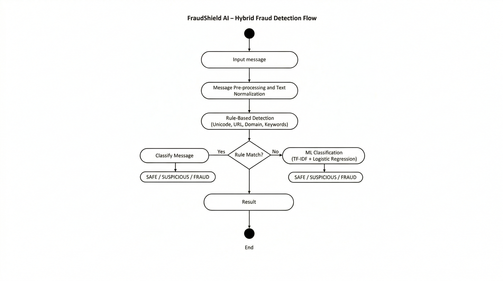

# FraudShield

Hybrid AI-based Bank Message Fraud Detection System

---

## About

FraudShield is a learning project focused on detecting fraudulent bank SMS/messages using a hybrid rule-based and machine learning approach.

---

## Hybrid Detection Approach

### Rule-Based Detection
- URL pattern analysis
- Suspicious domain checks
- Unicode / homograph attack detection
- Fraud-related keywords

### Machine Learning Model
- TF-IDF vectorization
- Logistic Regression classifier
- Confidence threshold handling

---

## Classification Labels
- SAFE
- SUSPICIOUS
- FRAUD

The system exposes a FastAPI backend and includes a lightweight web demo to demonstrate the end-to-end flow.

---

## System Flow

---

## How To Run

### 1. Clone Repository
git clone https://github.com/adityamandre25/FraudShield.git

cd FraudShield

### 2. Create Virtual Environment

Windows:

python -m venv venv
venv\Scripts\activate

Mac/Linux:

python3 -m venv venv
source venv/bin/activate

### 3. Install Dependencies

pip install -r requirements.txt

### 4. Start Server

uvicorn app.main:app --reload

Open in browser:

http://localhost:8000

---

## Sample Messages For Testing

### SAFE:
Amazon Pay: ₹50 cashback has been credited to your Amazon Pay balance.

### SUSPICIOUS:
Action required to maintain your access.

### FRAUD:
Dear User, your SBI KYC has expired. Update immediately at http://sbi-verify-secure.in to avoid account freeze.

---
## Notes
- This project is intended as a learning and demonstration exercise.